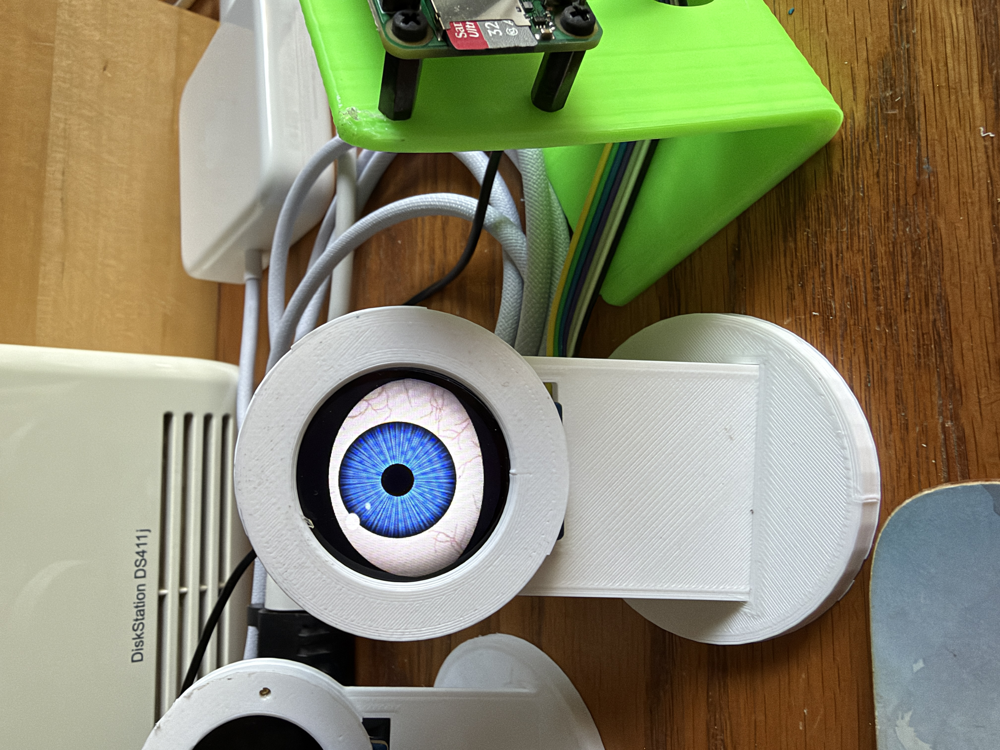
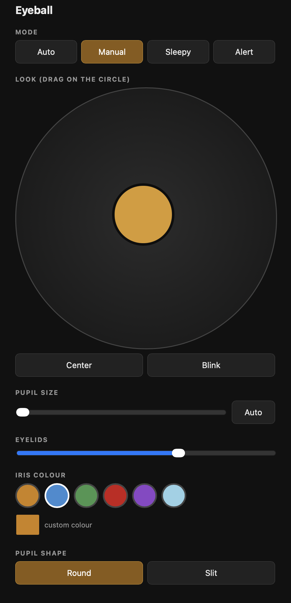

# Eyeball

A single animated eyeball for a 1.27"/1.28" round GC9A01A LCD (240×240), driven by
a Raspberry Pi Zero. It blinks, glances around on its own, and can be aimed and
styled live from a built-in web control page.



## Features

- Procedurally generated eye — sclera with blood vessels, iris with fine radial
  detail, moving highlight, and animated eyelids. No image assets required;
  everything is drawn in code and cached to disk after the first run.
- Natural idle behaviour — eased saccades (quick glances), randomized blinks
  (including occasional double-blinks), and a slowly breathing pupil size.
- Modes — `auto`, `manual`, `sleepy` (droopy lids, small pupil, slow blinks),
  and `alert` (wide open, dilated pupil, fixed stare).
- Web control page — served directly from the script, no extra setup.
  Drag to aim the eye, switch modes, adjust pupil/eyelid size, and change the
  iris colour or pupil shape (round or slit), all live.
- Simple HTTP API — every control on the page is also a plain URL, so the eye
  can be driven by other scripts or sensors (e.g. a PIR or sonar trigger).
- Performance-tuned for the Pi Zero — only changed screen regions are sent to
  the display, and RGB565 conversion uses Pillow's C routines rather than
  numpy, keeping idle animation close to 25 fps.



## Hardware

- Raspberry Pi Zero / Zero W
- 1.27" or 1.28" round LCD, GC9A01A driver, SPI interface (240×240)

Wiring uses the same SPI pins as this project's companion
[ADS-B radar display](https://github.com/robboz4/adsb-radar) — check the pin
block at the top of `eyeball.py` (`DC_PIN`, `CS_PIN`, `RST_PIN`, `BL_PIN`) and
adjust to match your own wiring.

## Setup

```bash
sudo apt install python3-numpy python3-pil libopenblas0
# or, inside a virtual environment:
pip install numpy pillow
```

If numpy complains about `libopenblas.so.0` inside a venv, either install
`libopenblas0` system-wide and enable `include-system-site-packages = true`
in the venv's `pyvenv.cfg`, or install it directly with apt as above.

## Running

```bash
python3 eyeball.py
```

This prints the web control address on start-up, e.g.:

```
Web control:  http://radar.local:8080   or   http://192.168.x.x:8080
```

Open that from any phone or computer on the same network.

Other flags:

| Flag         | Effect                                              |
|--------------|------------------------------------------------------|
| `--fps`      | Print a timing breakdown every 5 seconds             |
| `--no-web`   | Run without starting the web server                  |
| `--nohw`     | No display attached — for testing the web page alone |
| `--preview`  | Render a static preview sheet to `eye_preview.png`   |

Environment variables:

| Variable      | Effect                                   |
|---------------|-------------------------------------------|
| `EYE_PORT`    | Web server port (default `8080`)          |
| `EYE_SPI_HZ`  | SPI clock speed (default `32000000`)      |
| `EYE_CACHE`   | Sprite cache directory (default `./eye_cache`) |

The first run builds and caches all sprites (~10–15 seconds). Later runs load
from `eye_cache/` almost instantly. Delete that folder to force a rebuild.

## HTTP API

| Endpoint                          | Effect                                             |
|------------------------------------|-----------------------------------------------------|
| `GET /api/state`                   | Current mode, gaze, pupil, lids, colour, shape       |
| `GET /api/mode?m=`                 | `auto`, `manual`, `sleepy`, or `alert`               |
| `GET /api/gaze?x=&y=`              | Set gaze target (-1..1, +y is down); switches to `manual` |
| `GET /api/blink`                   | Trigger a single blink                               |
| `GET /api/pupil?v=`                | `0`–`1`, or `auto`                                   |
| `GET /api/lids?v=`                 | `0` (closed) – `1` (fully open)                      |
| `GET /api/style?color=&shape=`     | Iris colour (preset name or `#rrggbb`) and/or pupil shape (`round`/`slit`) |

This is how a motion or distance sensor script can drive the eye — e.g. call
`/api/mode?m=alert` when someone approaches and `/api/mode?m=auto` when they
leave.

## Notes

- The web page has no authentication — fine on a home network, not meant to
  be exposed to the internet.
- `LID_COLOR` defaults to black, which works well for Pepper's Ghost–style
  setups where black is invisible in the reflection.
